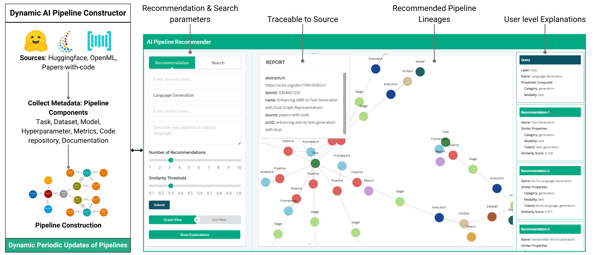
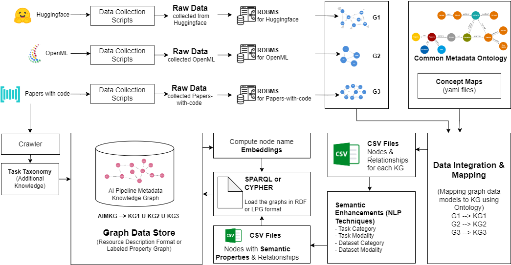

## AI Pipeline Metadata Knowledge Graph
The emergence of advanced Artificial Intelligence (AI) models has driven the development of frameworks and approaches that focus on automating model training and hyperparameter tuning of end-to-end AI pipelines. However, other crucial stages of these pipelines such as dataset selection, feature engineering, and model optimization for deployment have received less attention. Improving efficiency of end-to-end AI pipelines requires metadata of past executions of AI pipelines and all their stages. Regenerating metadata history by re-executing existing AI pipelines is computationally challenging and impractical. To address this issue, we propose to source AI pipeline metadata from open-source platforms like Papers-with-Code, OpenML, and Hugging Face. However, integrating and unifying the varying terminologies and data formats from these diverse sources is a challenge. In this paper, we present a solution by introducing Common Metadata Ontology (CMO) which is used to construct an extensive AI Pipeline Metadata Knowledge Graph (AIMKG) consisting of 1.6 million pipelines. Through semantic enhancements, the pipeline metadata in AIMKG is also enriched for downstream tasks such as search and recommendation of AI pipelines. We perform quantitative and qualitative evaluations on AIMKG to search and recommend relevant pipelines to user query. For quantitative evaluation we propose a custom aggregation model that outperforms other baselines by achieving a retrieval accuracy (R@1) of 76.3%. Our qualitative analysis shows that  AIMKG-based recommender retrieved relevant pipelines in 78% of test cases compared to the state-of-the-art MLSchema based recommender which retrieved relevant responses in 51% of the cases. AIMKG serves as an atlas for navigating the evolving AI landscape, providing practitioners with a comprehensive factsheet for their applications. It guides AI pipeline optimization, offers insights and recommendations for improving AI pipelines, and serves as a foundation for data mining and analysis of evolving AI workflows.

### Full Paper
The full paper along with supplementary materials can be found here[Constructing a metadata knowledge graph as an atlas for demystifying AI pipeline optimization](https://www.frontiersin.org/journals/big-data/articles/10.3389/fdata.2024.1476506/full)
### Video
The demo video of AI pipeline Recommendation can be found here - [Demo of AI pipeline Recommender](https://drive.google.com/drive/folders/1KEZJuyDLj3i9qWgXEigrhvuJ73a1OXak?usp=sharing)

 
 

 

 

### Data Sources
##### Papers-with-code
Papers-with-Code provides extensive metadata for research papers and associated code repositories, encompassing over 1 million entries. The metadata covers various components and stages of AI pipelines described in the papers. Through their API, Papers-with-Code offers metadata including PDF URLs, GitHub repository links, task details, dataset information, methods employed, and evaluation metrics/results. While not all stages of metadata are available for every paper through the API, the information can still be obtained by referring to the research papers and their code repositories.

##### OpenML
OpenML provides metadata on machine learning pipelines logged by users, offering detailed information on tasks, datasets, flows, runs with parameter settings, and evaluations. OpenML encompasses eight major task types executed on various datasets, resulting in 1,600 unique tasks. For each task, most recent 500 runs have been collected which amounts to a total of 330,000 runs. 

##### Huggingface
Huggingface is a model hub that offers users access to numerous pretrained models. It covers a wide range of tasks, including computer vision, natural language processing, tabular data, reinforcement learning, and multimodal learning. Huggingface provides model-centric information, along with datasets and evaluations, enabling the construction of complete pipelines. Currently, approximately 50,000 pipelines have been collected from Huggingface. 

### Common Metadata Ontology
As the data from various sources follow different nomenclature and data structure, we propose Common Metadata Ontology(CMO) to unify them. The overview of CMO can be found below and the details can be found at [common-metadata-ontology](common-metadata-ontology/readme.md) folder

### Mapping
The details of mapping of each sources to Common Metadata Ontology can be found in [kg-alignment](kg-alignment/readme.md) folder.

### AIMKG Hosting

