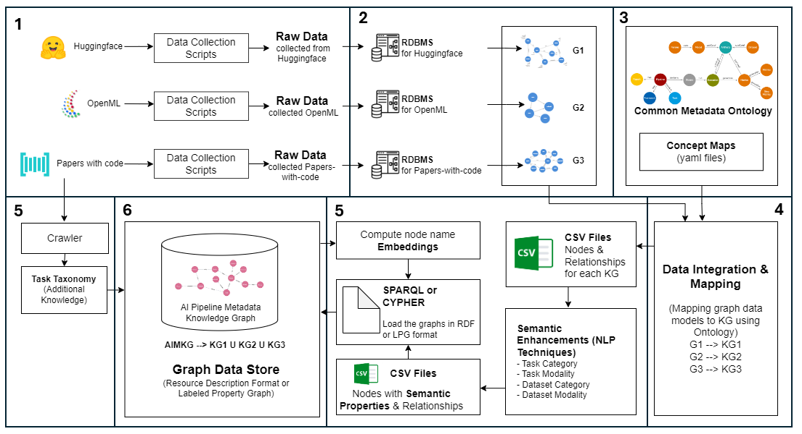
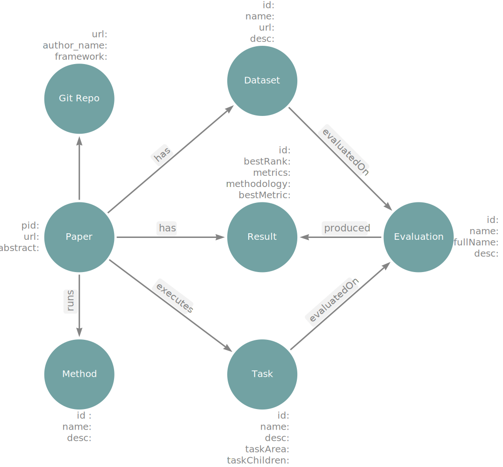
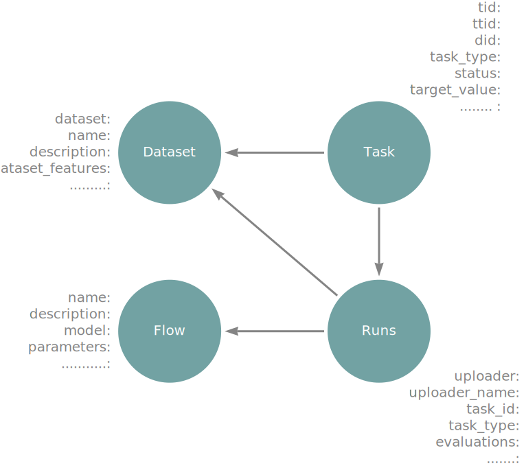
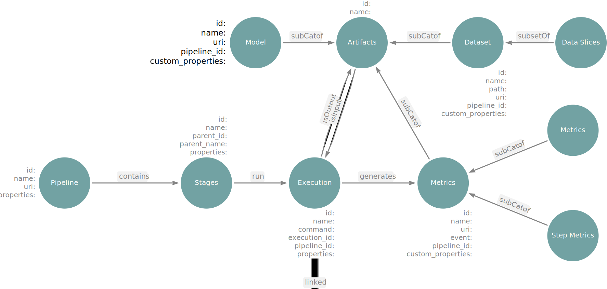
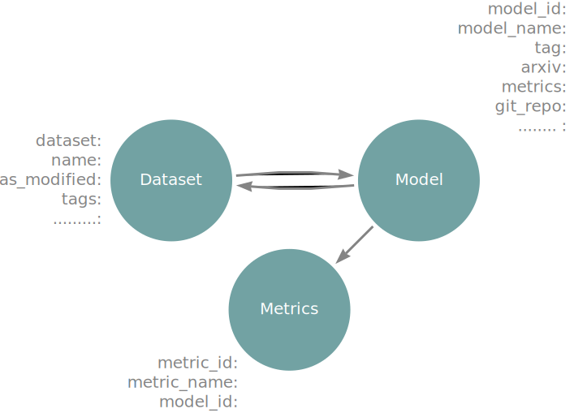
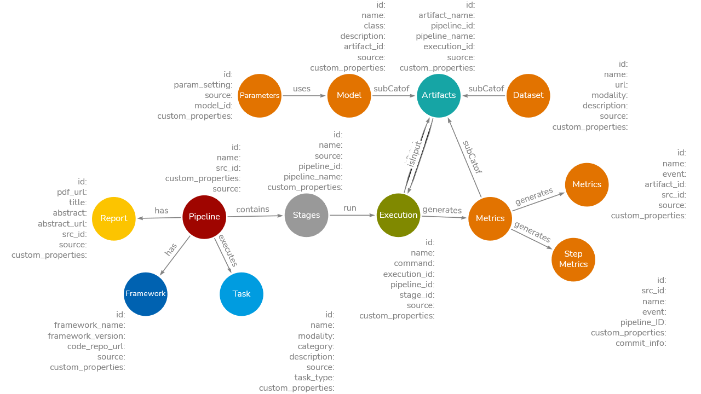
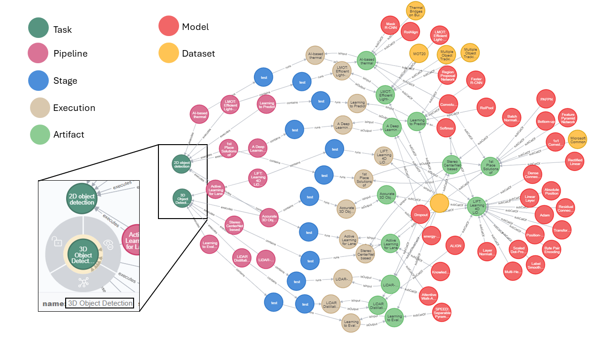

## AI Pipeline Metadata Knowledge Graph
<p align="justify">
The emergence of advanced Artificial Intelligence (AI) models has driven the development of frameworks and approaches that focus on automating model training and hyperparameter tuning of end-to-end AI pipelines. However, other crucial stages of these pipelines such as dataset selection, feature engineering, and model optimization for deployment have received less attention. Improving efficiency of end-to-end AI pipelines requires metadata of past executions of AI pipelines and all their stages. Regenerating metadata history by re-executing existing AI pipelines is computationally challenging and impractical. To address this issue, we propose to source AI pipeline metadata from open-source platforms like Papers-with-Code, OpenML, and Hugging Face. However, integrating and unifying the varying terminologies and data formats from these diverse sources is a challenge. In this paper, we present a solution by introducing Common Metadata Ontology (CMO) which is used to construct an extensive AI Pipeline Metadata Knowledge Graph (AIMKG) consisting of 1.6 million pipelines. Through semantic enhancements, the pipeline metadata in AIMKG is also enriched for downstream tasks such as search and recommendation of AI pipelines. We perform quantitative and qualitative evaluations on AIMKG to search and recommend relevant pipelines to user query. For quantitative evaluation we propose a custom aggregation model that outperforms other baselines by achieving a retrieval accuracy (R@1) of 76.3%. Our qualitative analysis shows that  AIMKG-based recommender retrieved relevant pipelines in 78% of test cases compared to the state-of-the-art MLSchema based recommender which retrieved relevant responses in 51% of the cases. AIMKG serves as an atlas for navigating the evolving AI landscape, providing practitioners with a comprehensive factsheet for their applications. It guides AI pipeline optimization, offers insights and recommendations for improving AI pipelines, and serves as a foundation for data mining and analysis of evolving AI workflows.
 </p>
 
<br>

<div style="text-align: center; margin-bottom: 20px;">
  <figure style='display: table'>
  
  <p>
    Figure 1:Dashboard of AI pipeline Recommender that uses Dynamic AI Pipeline Constructor to recommend relevant pipelines
  </p>
</figure>
</div>

<br>


### AIMKG Set up Guide
The construction details of AIMKG and recommendation can be below in the next sections. To set up AIMKG, please follow the steps below.

* Download the most recent version of docker as per your OS from here - https://docs.docker.com/desktop/release-notes/ and install the docker on your system
* Navigate to AIMKG folder and modify the parameters in .env file
* * Change the $USER and $UID in .env file. To find out the values `echo $USER` and `echo $UID` from your command terminal
* Create a virtual environment `python3 -m venv <myenv>` and activate it using `source <myenv>/bin/activate`
* Run `pip install -r requirements.txt`
* Download the sample dataset for AIMKG from [here]() and put it into a folder named `raw_files`
* Create another folder named `graph_data` where the graph database will be created
* Download the neo4j plugin [apoc-5.16.0-extended.jar](https://drive.google.com/file/d/12iVJVKnC4H-dYCx_-vhaKJwk9zzpXWzy/view?usp=sharing) and put it into a folder named `plugins`.
* Mention these paths in the docker-compose.yml file. Mention full path.
* * `<path to raw_folder>:/import`
* * `<path to graph_data>:/data`
* * `<path to plugins>:/var/lib/neo4j/plugins`
* Command to stand up the docker container `docker compose up --build`
* Access the notebook and neo4j from ports `https://localhost:8888` and `https://localhost:7474` respectively. 
* Run the notebooks to ingest data into the graph database
* The graph can be explored with the sample queries given below

#### Sample Queries
Following are some sample queries that can be run to test and visualize the data
* Models used for text classification:
```
MATCH path= ((:Task {category:'classification', modality:'text,multimodal'})<-[e:executes]-(p:Pipeline)-[r:runs]->(m)) RETURN p, r, m
```

* Pipelines with classification as task:
```
MATCH path = ((:Pipeline)-[]->(:Task {category:'classification'})) RETURN path
```

* Datasets used text recognition
```
MATCH path = ((:Task {category:'recognition', modality:'text'})-[]-(:Pipeline)-[]-(:Stage)-[]-(:Execution)-[]-(:Artifact)-[](:Dataset)) RETURN path
```


* Metrics on MNIST dataset
```
MATCH path = ((:Dataset {datasetID:'mnist'})-[]-(:Artifact)-[]-(:Metrics)) RETURN path
```


* Datasets and Models used by pipelines that executes some form of 'image detection' task
```
MATCH (a:Artifact)-[r3]-(e:Execution)-[r4]-(s:Stage)-[r5]-(p:Pipeline)-[r6]-(t:Task{category:'detection', modality:'image,multimodal'})
WITH a,e,s,p,t,r3,r4,r5,r6
MATCH (d:Dataset)-[r1]-(a)-[r2]-(m:Model)
RETURN d, a, m, e, s, p, t, r1, r2, r3,r4, r5, r6 limit 100

```

* Pipelines which are from papers-with-code and enriched with models from huggingface.
```
MATCH (t:Task)-[r1]-(p:Pipeline {source:'papers-with-code'})-[r2]-(s:Stage)-[r3]-(e:Execution)-[r4]-(a:Artifact)
WITH t,p,s,e,a,r1,r2,r3,r4
MATCH (d:Dataset)-[r5]-(a)-[r6]-(m:Model {source:'huggingface'})
return t,p,s,e,a,r1,r2,r3,r4,d,m,r5,r6
```

* Dataset, model and pipelines that uses the modelclass 'gpt2'
```
MATCH (d:Dataset)-[r1]-(a:Artifact)-[r2]-(m:Model {modelClass:'gpt2'})
WITH d,a,m,r1,r2
MATCH (a)-[r3]-(e:Execution)-[r4]-(s:Stage)-[r5]-(p:Pipeline)-[r6]-(t:Task)
RETURN d, a, m, e, s, p, t, r1, r2, r3,r4, r5, r6 limit 100

```

### AI Pipeline Recommendation Set Up Guide
Once the neo4j is up and running with AIMKG, the following steps will open-up a UI to query the graph using natural language or find pipelines based on similar datasets, similar models or similar tasks
* Navigate to `aimkg-recommender-UI` folder
* Navigate to utils folder and run `compute_embeddings.py`. This is a one-time step done once.
* Navigate back to the `aimkg-recommender-UI` folder and run `python app.py` and the UI will stand up at the address mentioned in your terminal. The sample of the UI is shown in Figure 1 and the demo can be found [here](https://drive.google.com/drive/folders/1KEZJuyDLj3i9qWgXEigrhvuJ73a1OXak?usp=sharing)


### Full Paper
The full paper along with supplementary materials can be found here[Constructing a metadata knowledge graph as an atlas for demystifying AI pipeline optimization](https://www.frontiersin.org/journals/big-data/articles/10.3389/fdata.2024.1476506/full)

### Video
The demo video of AI pipeline Recommendation can be found here - [Demo of AI pipeline Recommender](https://drive.google.com/drive/folders/1KEZJuyDLj3i9qWgXEigrhvuJ73a1OXak?usp=sharing)

<br>


### AIMKG Construction
The construction of AIMKG is described in the figure below. The construction involves following steps:

* Data Collection
* Exploratory Data Analysis
* Common Metadata Ontology
* Mapping Concepts to Common Metadata Ontology
* Semantic Enrichments
* Data Ingestion to Graph Database(Neo4j)

<div style="flex: 80%; padding: 5px; text-align: center;">
    <p style="margin-bottom: 5px; text-align: center; font-style: italic; font-weight: bold;">Construction of AI pipeline Metadata Knowledge Graph</p>
    <br>
    
</div>


#### 1. Data Collection
* **Papers-with-code:** Papers-with-Code provides extensive metadata for research papers and associated code repositories, encompassing over 1 million entries. The metadata covers various components and stages of AI pipelines described in the papers. Through their API, Papers-with-Code offers metadata including PDF URLs, GitHub repository links, task details, dataset information, methods employed, and evaluation metrics/results. While not all stages of metadata are available for every paper through the API, the information can still be obtained by referring to the research papers and their code repositories.

* **OpenML:**OpenML provides metadata on machine learning pipelines logged by users, offering detailed information on tasks, datasets, flows, runs with parameter settings, and evaluations. OpenML encompasses eight major task types executed on various datasets, resulting in 1,600 unique tasks. For each task, most recent 500 runs have been collected which amounts to a total of 330,000 runs. 

* **Huggingface:**Huggingface is a model hub that offers users access to numerous pretrained models. It covers a wide range of tasks, including computer vision, natural language processing, tabular data, reinforcement learning, and multimodal learning. Huggingface provides model-centric information, along with datasets and evaluations, enabling the construction of complete pipelines. Currently, approximately 50,000 pipelines have been collected from Huggingface. 


#### 2. Exploratory Data Analysis
The exploratory data analysis of collected data showed different data structures and varying nomeclatures to denote similar concepts. For example, the concept model is referred is methods in Papers-with-code, flow in OpenML and models in Huggingface.

<div style="display: flex; flex-wrap: wrap;">
  <div style="flex: 40%; padding: 5px; text-align: center;">
      <p style="margin-bottom: 5px; text-align: center; font-style: italic; font-weight: bold;">Graph Data Model: Papers-with-code</p> <br>
    
      
  </div>
  <div style="flex: 40%; padding: 5px; text-align: center;">
      <p style="margin-bottom: 5px; text-align: center; font-style: italic; font-weight: bold;">Graph Data Model: OpenML</p> <br>
    
      
  </div>
</div>
<br>
<div style="display: flex; flex-wrap: wrap;">
  <div style="flex: 40%; padding: 5px;">
      <p style="margin-bottom: 5px; text-align: center; font-style: italic; font-weight: bold;">Graph Data Model: Common Metadata Framework</p> <br>
    
  </div>
  <div style="flex: 40%; padding: 5px;">
      <p style="margin-bottom: 5px; text-align: center; font-style: italic; font-weight: bold;">Graph Data Model: Huggingface</p> <br>
    
  </div>
</div></table>


#### 3. Common Metadata Ontology
The data collected from above mentioned sources consists of [different nomenclature and data structures](ai-pipeline-datasources/readme.md). In order to unify them, Common Metadata Ontology (CMO) was designed based on the principles of [Common Metadata Framework (CMF)](https://github.com/HewlettPackard/cmf) which follows a pipeline-centric framework. MLFlow, which follows a model-centric approach will require separate instantiation of each model even if they are being executed for the same pipeline, say, Entity Extraction from Semi-Structed documents. CMF encompasses all the models and datasets of a pipeline under single instantiation enabling search of best execution path. The overview of CMO can be found below and the details can be found at [common-metadata-ontology](common-metadata-ontology/readme.md) folder


<div style="flex: 90%; padding: 5px; text-align: center;">
    <p style="margin-bottom: 5px; text-align: center; font-style: italic; font-weight: bold;">Overview of Common Metadata Ontology</p>
    <br>
    
</div>>


#### 4. Mapping
The concepts from Papers-with-code, OpenML and Huggingface are mapped to CMO to construct AIMKG. The details of mapping of each sources to Common Metadata Ontology can be found in [mapping](mapping/mapping_readme.md) folder.

#### 5.Semantic Enrichments
In order to enable contextually relevant queries, semantic enrichments are performed on the data entities. For example, in the figure below, the user searched for "Image Detection" task and its pipeline. It can be noticed that both "2D Object Detection" and "3D object Detection" are returned as results which do not explicitly have the name "image" in them. Such semantic enhancements are done for tasks, datasets and models. The methods and techniques are detailed [here](semantic-enrichments/semantics_readme.md)

<div style="flex: 90%; padding: 5px; text-align: center;">
    <p style="margin-bottom: 5px; text-align: center; font-style: italic; font-weight: bold;">
    </p>
    <br>
    
</div>>

#### 6. Data Ingestion
The data gathered and semantically enriched are then loaded to Neo4j Graph DB to perform serach and recommendation. The steps to set-up the graph DB are mentioned in the section [Set Up Guide](#aimkg-set-up-guide)


## Publications
* Venkataramanan, Revathy, Aalap Tripathy, Tarun Kumar, Sergey Serebryakov, Annmary Justine, Arpit Shah, Suparna Bhattacharya et al. "Constructing a Metadata Knowledge Graph as an atlas for demystifying AI Pipeline optimization." Frontiers in Big Data 7: 1476506. [Link to the paper](https://www.frontiersin.org/journals/big-data/articles/10.3389/fdata.2024.1476506/full)
* Venkataramanan, Revathy, Aalap Tripathy, Martin Foltin, Hong Yung Yip, Annmary Justine, and Amit Sheth. "Knowledge graph empowered machine learning pipelines for improved efficiency, reusability, and explainability." IEEE Internet Computing 27, no. 1 (2023): 81-88. [Link to the paper](https://ieeexplore.ieee.org/stamp/stamp.jsp?arnumber=10044293&casa_token=gZ8lwivSW1oAAAAA:5390SDEkYDpck4EduA3iUG6fO5Vdbi3WRcyTpJTv0yz_lliAb8xurwH3z2SvlOzqTT932dKPvfk&tag=1)