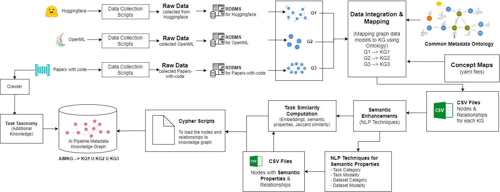

# AI Pipeline Knowledge Graph
This repo builds AI Pipeline Metadata Kowledge Graph (AI-MKG) from public data sources such as Papers-with-code, Openml, Huggingface, Kaggle and Common Metadata Framework (CMF) metadata. The overall architecture can be found below.



Figure: Architecture for AI-MKG construction. CMF and Kaggle are being studied to be included in the AI-MKG.

### Common Metadata Ontology
The Common Metadata Ontology (CMO) which is used to integrate and aggregate metadata from various open-sources can be found [here](docs/common-metadata-ontology/readme.md)

### KG- Alignment
The mapping of concepts from various open-sources to CMO can be found [here](docs/kg-alignment/readme.md)


## Quickstart for Neo4j_5.16
This repository includes code to use the data generated by the AI pipeline data-sources repository (https://www.gethib.hpe.com/ai-pipeline-data-sources) and craft it into an AI Pipeline knowledge graph.

- `docker-compose up -d --build`
- Create a file `.env` with customizations of `env-example` in the repo
- This will standup a neo4j community image with the following plugins installed and accessible at http://localhost:7474
    - "apoc" - - https://github.com/neo4j-contrib/neo4j-apoc-procedures/releases (download the extended version named: apoc-5.16.0-extended.jar)
- This will also standup a JupyterLab Data Science image with the following python clients installed at http://localhost:8888/ : 
    - neo4j - https://github.com/neo4j/neo4j-python-driver
    - py2neo - (Alternative to above) https://github.com/py2neo-org/py2neo
    - graphdatascience - https://github.com/neo4j/graph-data-science-client
- Running the Jupyterlab `notebooks/nlp-knowledge-graph.ipynb` will populate the Neo4J DB. Queries will be made in neo4j browser at http://localhost:7474 to visualize ontologies, creation of a knowledge graph from dev.to articles using Wikidata 


## Data Folders
The current data folders to be mounted in docker-compose file are in the following locations:
- /lustre/data/dataspaces/ai-pipeline-metadata/neo4j/data_detail:/data
- /lustre/data/dataspaces/ai-pipeline-metadata/kg-v2-detail:/var/lib/neo4j/import
Please make a copy of data_detail and kg-v2-detail and mount it in the docker-compose file.

### Sample Queries
Following are some sample queries that can be run to test and visualize the data
* Models used for text classification:
```
MATCH path= ((:Task {category:'classification', modality:'text,multimodal'})<-[e:executes]-(p:Pipeline)-[r:runs]->(m)) RETURN p, r, m
```

* Pipelines with classification as task:
```
MATCH path = ((:Pipeline)-[]->(:Task {category:'classification'})) RETURN path
```


* Datasets used text recognition
```
MATCH path = ((:Task {category:'recognition', modality:'text'})-[]-(:Pipeline)-[]-(:Stage)-[]-(:Execution)-[]-(:Artifact)-[](:Dataset)) RETURN path
```


* Metrics on MNIST dataset
```
MATCH path = ((:Dataset {datasetID:'mnist'})-[]-(:Artifact)-[]-(:Metrics)) RETURN path
```


* Datasets and Models used by pipelines that executes some form of 'image detection' task
```
MATCH (a:Artifact)-[r3]-(e:Execution)-[r4]-(s:Stage)-[r5]-(p:Pipeline)-[r6]-(t:Task{category:'detection', modality:'image,multimodal'})
WITH a,e,s,p,t,r3,r4,r5,r6
MATCH (d:Dataset)-[r1]-(a)-[r2]-(m:Model)
RETURN d, a, m, e, s, p, t, r1, r2, r3,r4, r5, r6 limit 100

```


* Pipelines which are from papers-with-code and enriched with models from huggingface.
```
MATCH (t:Task)-[r1]-(p:Pipeline {source:'papers-with-code'})-[r2]-(s:Stage)-[r3]-(e:Execution)-[r4]-(a:Artifact)
WITH t,p,s,e,a,r1,r2,r3,r4
MATCH (d:Dataset)-[r5]-(a)-[r6]-(m:Model {source:'huggingface'})
return t,p,s,e,a,r1,r2,r3,r4,d,m,r5,r6
```


* Dataset, model and pipelines that uses the modelclass 'gpt2'
```
MATCH (d:Dataset)-[r1]-(a:Artifact)-[r2]-(m:Model {modelClass:'gpt2'})
WITH d,a,m,r1,r2
MATCH (a)-[r3]-(e:Execution)-[r4]-(s:Stage)-[r5]-(p:Pipeline)-[r6]-(t:Task)
RETURN d, a, m, e, s, p, t, r1, r2, r3,r4, r5, r6 limit 100
```


## Quickstart for Neo4j_4.3.1
This repository includes code to use the data generated by the AI pipeline data-sources repository (https://www.gethib.hpe.com/ai-pipeline-data-sources) and craft it into an AI Pipeline knowledge graph.

- `docker-compose up -d --build`
- Create a file `.env` with customizations of `env-example` in the repo
- This will standup a neo4j community image with the following plugins installed and accessible at http://localhost:7474
    - "apoc" - https://github.com/neo4j/apoc 
    - "n10s" - https://github.com/neo4j-labs/neosemantics
    - "graph-data-science" - https://neo4j.com/docs/graph-data-science/current/installation/
- This will also standup a JupyterLab Data Science image with the following python clients installed at http://localhost:8888/ : 
    - neo4j - https://github.com/neo4j/neo4j-python-driver
    - py2neo - (Alternative to above) https://github.com/py2neo-org/py2neo
    - graphdatascience - https://github.com/neo4j/graph-data-science-client
- Running the Jupyterlab `notebooks/nlp-knowledge-graph.ipynb` will populate the Neo4J DB. Queries will be made in neo4j browser at http://localhost:7474 to visualize ontologies, creation of a knowledge graph from dev.to articles using Wikidata 


## Other Projects
This is linked with the other projects: 
- https://github.hpe.com/hpe/ai-pipeline-datasources
- https://github.hpe.com/hpe/ai-pipeline-recommender

## References
- https://github.com/neo4j-examples/nlp-knowledge-graph (source of `:play https://guides.neo4j.com/nlp_knowledge_graphs` )
- Video: https://www.youtube.com/watch?v=17NRCNqqbcA and https://neo4j.com/connections/knowledge-graphs/ 
- https://towardsdatascience.com/how-to-build-a-knowledge-graph-with-neo4j-and-transformers-72b9471d6969


### ERRORS
* conda env creation stuck at solving environment. Run the following and rerun conda create command
`conda config --remove channels defaults`
`conda config --add channels conda-forge`
`conda create --name <conda_env_name>`

* conda package installation stuck at "Solving environment: failed with initial frozen solve. Retrying with flexible solve". <br>
Solution - https://stackoverflow.com/questions/74781771/how-we-can-resolve-solving-environment-failed-with-initial-frozen-solve-retry. Try to install the package with solver command rather than setting the solver as default. That is,
`conda install -n base conda-libmamba-solver` #install the solver
`conda install tensorflow --solver=libmamba` #install the package with solver